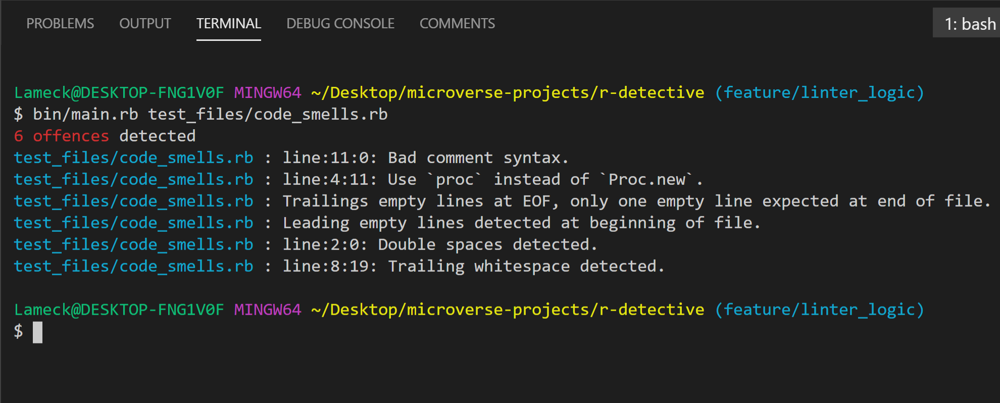

---


# R-DETECTIVE
## Table of Contents

* [About the Project](#about-the-project)
* [Built With](#built-with)
* [Getting Started](#getting-started)
* [Prerequisites](#prerequisites)
* [Contributing](#contributing)
* [Author](#author)
* [License](#license)
* [Acknowledgements](#acknowledgements)

## About Project




R-detective is a beginner code analysis tool developed as Part of Microverse Ruby Capstone project. This tool provides feedback about code errors.

###### r-detector detects the following error

- bad comment syntax
- bad file name
- Proc.New usage
- trailing empty lines
- source file too long
- leading empty lines
- double spaces
- trailing spaces
## Built With

- RUBY

## Examples of Good and Bad Code as per r-detector rules
#### Bad comment syntax

    ```
    # not acceptable

    #Bad Comment
    ```

    ```
    # acceptable

    # Good Comment
    ```
#### Bad file name

    ```
    # not acceptable

    FileName
    ```

    ```
    # acceptable

    file_name
    ```
#### Proc.New usage

    ```
    # not acceptable

    Proc.new
    ```

    ```
    # acceptable

    proc
    ```
    
#### Source file too long

    ```
    # not acceptable

    reader = FileReader.new(path)
    reader.file_lines.length > 100
    ```

    ```
    # acceptable

    reader = FileReader.new(path)
    reader.file_lines.length <= 100
    ```
#### Leading empty lines

    ```
    # not acceptable

    ---------------------
                        <- empty leading line
    require 'colorize'
    ```

    ```
    # acceptable

    ---------------------
    require 'colorize'
    ```
#### Double spaces

    ```
    # not acceptable

    def   multiplication

        ^double spacing
    ```

    ```
    # acceptable

    def multiplication

       ^single space
    ```
#### Trailing spaces

    ```
    # not acceptable

    def my_method   |<- denoting trailing spaces
    ```

    ```
    # acceptable

    def my_method|<- no trailing spaces
    ```    

## Getting Started

* Clone this repo https://github.com/Lameck1/r-detective
* Navigate to project directory. ```cd r-detective```
* Run ```bundle install``` to install dependencies
* Lastly run ```bin/main.rb test_files/code_smells.rb``` to check for errors the file ```code_smells.rb``

## NOTICE: 
This directory [Test Files](./test_files/), have been excluded from rubocop because it contains files only for testing the r-detective

## Running Test

- Run ```rspec```

### Prerequisites

- Ensure you have git installed.
- Ensure you have ruby programming language installed.


## Contributing

Contributions, issues, and feature requests are welcome!

Feel free to check the [issues page](https://github.com/Lameck1/r-detective/issues).

## Author

👤 **Lameck Otieno**
  - GitHub: [@githubhandle](https://github.com/Lameck1)
  - Twitter: [@twitterhandle](https://twitter.com/lameck721)
  - LinkedIn: [LinkedIn](https://www.linkedin.com/in/lameck-odhiambo-642b7077/)


## License

This project is [MIT](./LICENSE) licensed.

## Acknowledgements

Credits go to the following
  - [Ruby Guides:](https://www.rubyguides.com/2015/06/ruby-regex/)
  - [Ruby Docs:](https://docs.ruby-lang.org/en/2.5.0/Regexp.html)

Other
  - Fontawesome

## Show your support

Give a ⭐️ if you like this project!
